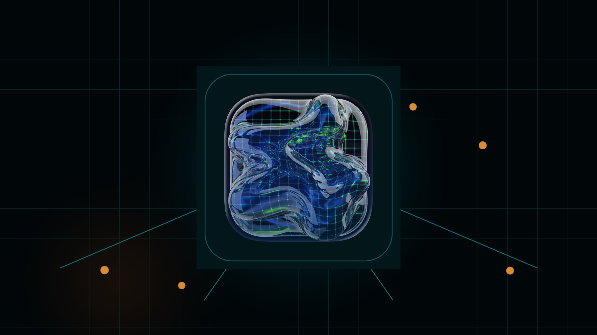
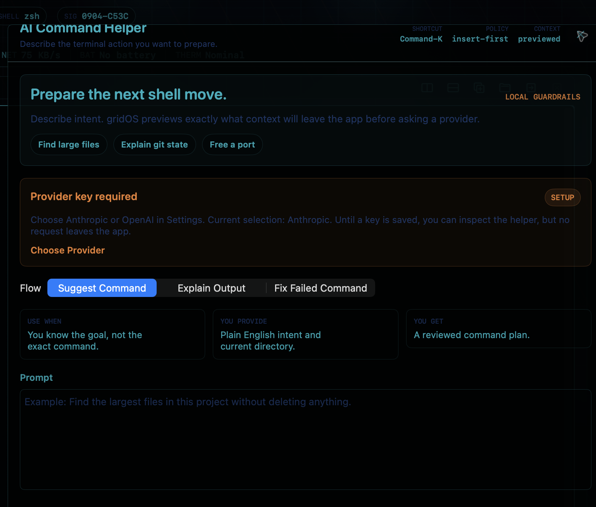
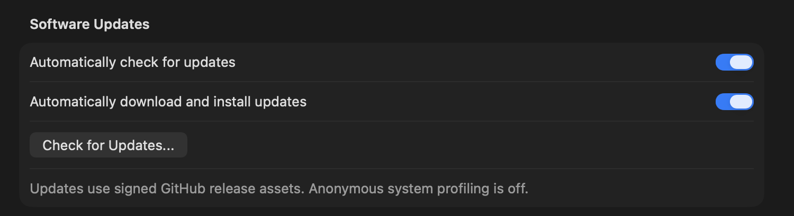

<p align="center">
  
</p>

<h1 align="center">gridOS</h1>

<p align="center">
  <strong>A native Apple Silicon terminal cockpit: real shell first, local system signal around it, and AI help that previews before it asks.</strong>
</p>

<p align="center">
  <a href="https://github.com/aaldere1/gridOS/releases/download/v1.0.5/gridOS-1.0.5-13-379289a.dmg"><strong>Download v1.0.5 DMG</strong></a>
  &nbsp;|&nbsp;
  <a href="https://github.com/aaldere1/gridOS/releases/tag/v1.0.5">Release</a>
  &nbsp;|&nbsp;
  <a href="docs/release-notes/v1.0.5.md">Notes</a>
  &nbsp;|&nbsp;
  <a href="docs/security-privacy.md">Security and Privacy</a>
</p>

<p align="center">
  <a href="https://github.com/aaldere1/gridOS/releases/tag/v1.0.5"></a>
  
  
  
</p>

<p align="center">
  <sub>Hero image is a brand visual built from the app icon, not a product screenshot. Screenshots below avoid terminal prompts and local usernames.</sub>
</p>

## Why It Exists

gridOS is for the kind of Mac user who wants a terminal that feels worth leaving
open all day. It is a real terminal first, surrounded by local system signal,
saved workspace state, and a visual identity that feels native to the machine
instead of pasted onto it.

The cinematic spark comes from eDEX-UI, but gridOS is a from-scratch Swift,
SwiftUI, AppKit, Metal, and SwiftTerm application. The point is not nostalgia.
The point is a beautiful command workspace that stays careful with real work.

> gridOS is public and source-visible for inspection, but it is not open source.
> The current license is proprietary unless a different license is explicitly
> published by the copyright holder.

## Current Release

| Field | Value |
| --- | --- |
| Version | `1.0.5` |
| Build | `13` |
| Platform | macOS 14 or newer, Apple Silicon |
| Distribution | Developer ID signed, notarized direct-download DMG |
| Release page | [`v1.0.5`](https://github.com/aaldere1/gridOS/releases/tag/v1.0.5) |
| DMG SHA-256 | `b3f94f03ca5db2f1c3fa9fb1df0fa0cdcacd6998927a878fc6b312768e0c5a05` |

Version 1.0.5 focuses on making AI Command Helper understandable the first time
someone presses Command-K, making Settings behave like a real resizable macOS
window, and deriving the visible app version from signed bundle metadata so the
UI cannot drift from the release artifact.

## Actual Screenshots

<p>
  
</p>

<p>
  
</p>

The screenshots are captured from the current app UI, not generated product art,
and intentionally avoid terminal panes, shell prompts, usernames, and process
details.

## What Ships

- Native multi-pane terminal workspace with saved layout and recent directories.
- Open Folder command for starting work in a chosen project directory.
- Live local CPU, memory, network, battery, thermal, and process signal.
- Procedural visual modes for Tron, Severance, and Apple-native looks.
- Local launch briefing that explains privacy and command-safety defaults.
- AI Command Helper with optional Anthropic or OpenAI provider keys.
- Keychain-backed provider key storage.
- Preview-first provider requests: gridOS shows redacted context before a request leaves the app.
- Local generated-command risk labels with insert-first behavior and explicit run confirmation.
- Sparkle automatic updates backed by signed GitHub release assets.
- Polished drag-to-Applications DMG layout.

## AI Command Helper

Command-K is designed as a guarded command surface, not a magic text box.

- **Suggest Command** turns an intent into a command draft.
- **Explain Output** helps read selected terminal output.
- **Fix Failed Command** helps reason about an error and a safer next attempt.
- Provider keys are optional and stored in the macOS Keychain.
- Requests go only to the provider the user configures: Anthropic or OpenAI.
- Commands are inserted for review first; generated commands do not auto-run.
- Higher-risk command shapes stay behind an explicit confirmation path.

## Install

1. Download [`gridOS-1.0.5-13-379289a.dmg`](https://github.com/aaldere1/gridOS/releases/download/v1.0.5/gridOS-1.0.5-13-379289a.dmg).
2. Open the DMG.
3. Drag `gridOS.app` into `/Applications`.
4. Eject the DMG.
5. Launch gridOS from Finder.

If macOS blocks launch, do not bypass Gatekeeper. Treat that as a release issue:
the current release is expected to be signed, notarized, stapled, and
Gatekeeper-accepted.

## Updates

gridOS includes Sparkle automatic updates for the direct-download lane.
Automatic checks and automatic install are enabled by default, system profiling
is off, and the manual DMG flow remains available as a fallback.

For manual updates:

1. Quit gridOS.
2. Download the newer signed and notarized DMG.
3. Verify the SHA-256 against the release page or manifest.
4. Replace the installed app in `/Applications`.
5. Launch from Finder and confirm the visible version.

Local replacement proof has passed from 1.0.4 build 12 to 1.0.5 build 13. Clean
Mac install/update proof remains the final external validation item.

## Privacy Boundaries

gridOS currently ships with conservative defaults:

- No telemetry.
- Automatic update checks use the signed Sparkle appcast and GitHub release assets; Sparkle system profiling is off.
- No automatic crash upload.
- No automatic diagnostics upload.
- No automatic LLM request without an explicit user action.
- No automatic command execution from provider responses.
- No persisted shell history, terminal transcripts, raw prompts, provider responses, or generated commands.
- No App Store sandboxed build yet; App Store readiness is tracked separately in [`docs/app-store-readiness.md`](docs/app-store-readiness.md).

See [`docs/security-privacy.md`](docs/security-privacy.md),
[`docs/privacy-data-inventory.md`](docs/privacy-data-inventory.md), and
[`docs/security-threat-model.md`](docs/security-threat-model.md) for the current
security posture.

## Verification

The 1.0.5 release has recorded proof for the direct-download lane:

- App and DMG signing.
- Notarization and stapler validation.
- Gatekeeper assessment.
- Strict codesign verification.
- Launch from mounted DMG.
- Visible `v1.0.5` app check.
- AI Command Helper and Settings path inspection.
- DMG drag-to-Applications layout inspection.
- Local 1.0.4 to 1.0.5 replacement proof.

The release checklist lives in
[`docs/production-direct-release.md`](docs/production-direct-release.md).

## Build From Source

Requires Xcode and XcodeGen.

```sh
xcodegen generate --use-cache
xcodebuild -project gridOS.xcodeproj -scheme gridOS -destination 'platform=macOS,arch=arm64' CODE_SIGNING_ALLOWED=NO build test
```

Open `gridOS.xcodeproj` in Xcode after generating it.

The signed direct-download lane is driven by the release scripts under
[`scripts/`](scripts/). Release artifacts must be built from a committed source
revision so the DMG, ZIP, and manifest point at a stable source commit.

## Next Polish

- Run clean-Mac Finder/Gatekeeper UAT for the public 1.0.5 DMG.
- Prove clean-Mac replacement/update flow from 1.0.4 build 12 to 1.0.5 build 13.
- Collect first-user feedback on whether AI Command Helper feels useful enough for daily terminal work.
- Polish AI Command Helper result states based on that feedback.
- Decide whether GitHub Releases stays the download surface or a small branded download page should front it.

## Acknowledgments

- [SwiftTerm](https://github.com/migueldeicaza/SwiftTerm) for terminal emulation.
- eDEX-UI for the cinematic terminal-cockpit spark.

## License

Proprietary. See [`LICENSE`](LICENSE).
